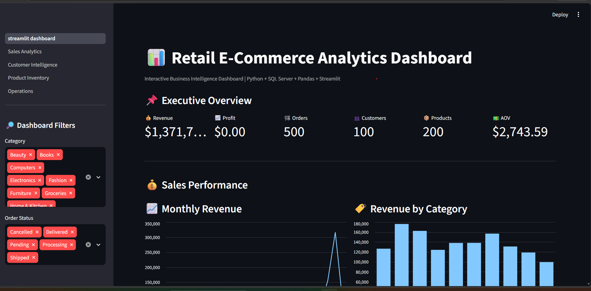
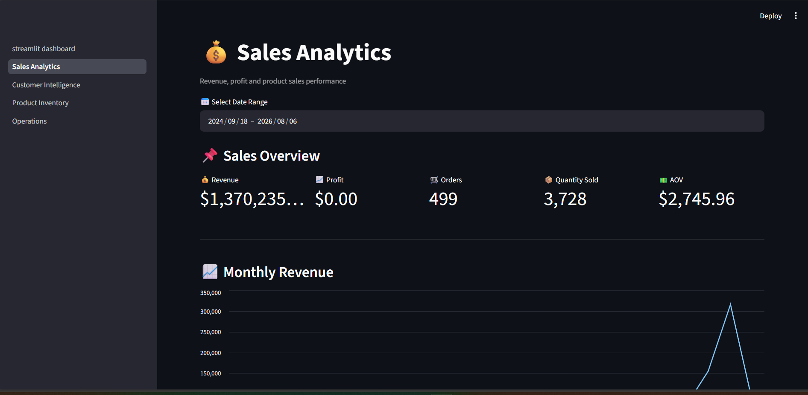
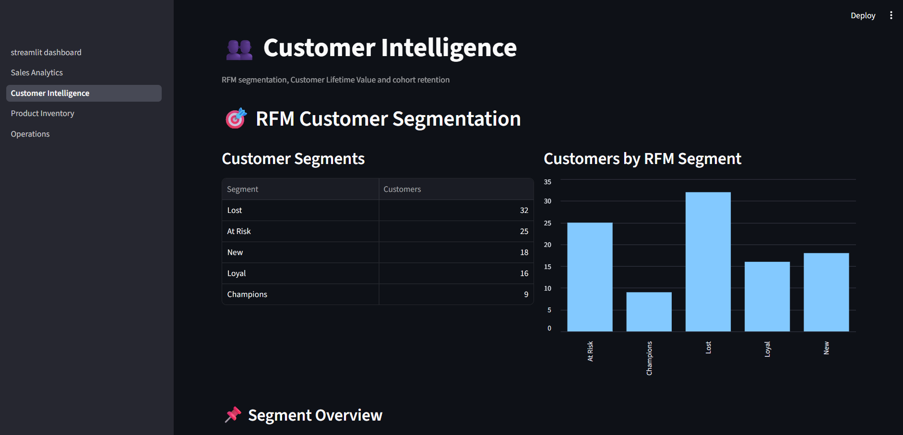
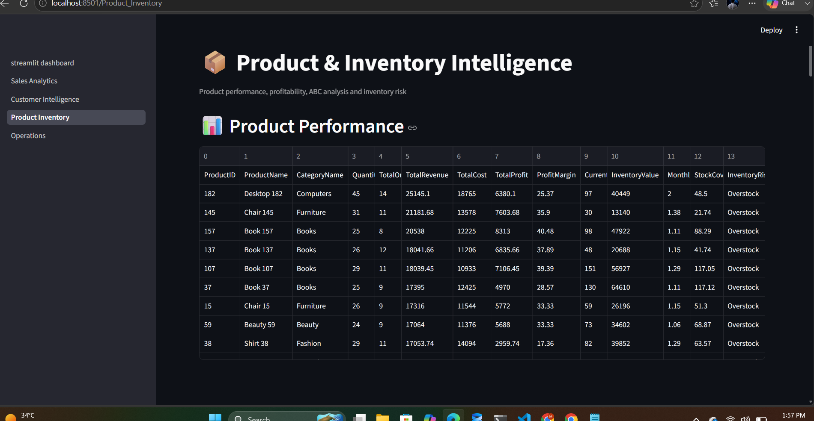
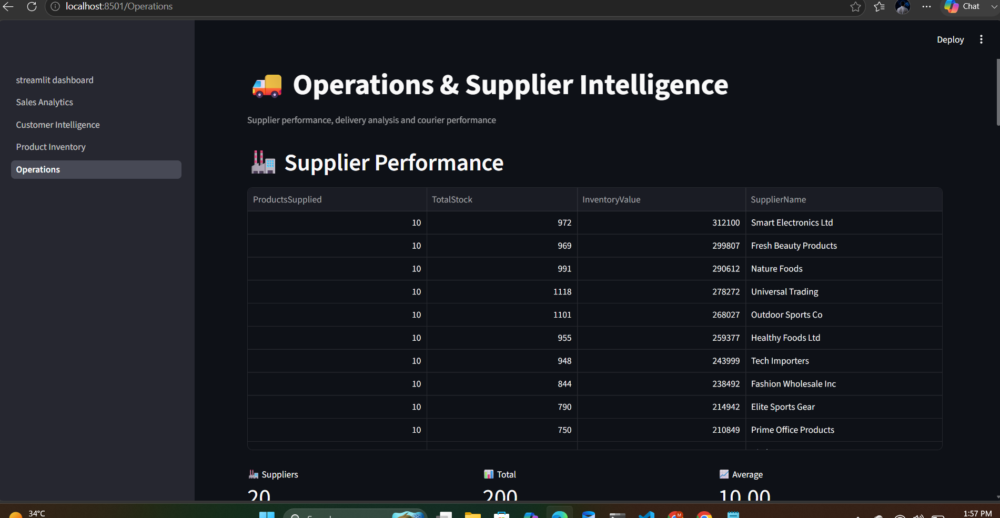

\# 📊 Retail E-Commerce Analytics Dashboard


A complete end-to-end Retail E-Commerce Analytics project built using Python, SQL Server, Pandas, Excel, and Streamlit.


\---


\## 🚀 Project Overview


This project analyzes retail e-commerce data to generate actionable business insights related to:


\- Sales Performance

\- Customer Behavior

\- RFM Customer Segmentation

\- Customer Lifetime Value (CLV)

\- Cohort Retention

\- Product Performance

\- ABC Analysis

\- Inventory Risk

\- Supplier Performance

\- Delivery Operations


\---


\## 🛠️ Technologies Used


\- Python

\- SQL Server

\- SQL

\- Pandas

\- NumPy

\- Streamlit

\- SQLAlchemy

\- PyODBC

\- OpenPyXL

\- Excel

\- Git

\- GitHub


\---


\## 📈 Dashboard Pages


\### 1. Executive Dashboard


The Executive Dashboard provides a high-level business overview including:


\- Revenue

\- Profit

\- Orders

\- Customers

\- Products

\- Average Order Value

\- Monthly Revenue

\- Category Performance


\### 2. Sales Analytics


Sales analysis includes:


\- Revenue Trends

\- Category Analysis

\- Payment Method Analysis

\- Order Status Analysis

\- Product Sales Performance


\### 3. Customer Intelligence


Customer analytics includes:


\- RFM Segmentation

\- Customer Lifetime Value

\- Cohort Analysis

\- Retention Matrix

\- Customer Insights


\### 4. Product \& Inventory


Product and inventory analysis includes:


\- Product Scorecard

\- ABC Analysis

\- Inventory Risk

\- Top Revenue Products

\- Top Profit Products

\- Sales Velocity

\- Low Stock Analysis

\- Dead Stock Analysis

\- Overstock Analysis


\### 5. Operations


Operations analytics includes:


\- Supplier Scorecard

\- Delivery Analysis

\- Courier Performance

\- Shipment Status

\- Operations Insights


\---


\## 🗄️ Database


\*\*Database Name:\*\*


`RetailECommerceDB`


\*\*SQL Server:\*\*


`ZUBAIR\\SQLEXPRESS`


The database includes the following major business areas:


\- Customers

\- Orders

\- Order Items

\- Products

\- Categories

\- Payments

\- Reviews

\- Inventory

\- Suppliers

\- Shipments

\- Employees


\---


\## 🧠 Key Analytics


\### RFM Analysis


Customers are segmented based on:


\- \*\*Recency\*\* — How recently a customer made a purchase

\- \*\*Frequency\*\* — How frequently a customer makes purchases

\- \*\*Monetary\*\* — How much revenue a customer contributes


Customer segments include:


\- Champions

\- Loyal

\- New

\- At Risk

\- Lost


\---


\### Customer Lifetime Value


The project uses a baseline CLV model based on:


\- Average Order Value

\- Purchase Frequency

\- Gross Margin

\- Assumed Customer Lifespan


This helps identify high-value customers.


\---


\### Cohort Analysis


Customers are grouped according to their first purchase month.


Their purchasing behavior is then tracked across future months to analyze:


\- Customer Retention

\- Repeat Purchasing Behavior

\- Cohort Performance


\---


\### ABC Analysis


Products are classified based on their contribution to total business revenue.


Classes include:


\- \*\*A\*\* — High-value products

\- \*\*B\*\* — Medium-value products

\- \*\*C\*\* — Lower-value products


\---


\## 📁 Project Structure


```text

Python\_SQL\_Analysis/

│

├── streamlit\_dashboard.py

│

├── pages/

│   ├── 1\_Sales\_Analytics.py

│   ├── 2\_Customer\_Intelligence.py

│   ├── 3\_Product\_Inventory.py

│   └── 4\_Operations.py

│

├── rfm\_analysis.py

├── cohort\_clv\_analysis.py

├── clv\_analysis.py

├── product\_inventory\_analysis.py

├── supplier\_operations\_analysis.py

│

├── Retail\_ECommerce\_Final\_Portfolio.xlsx

│

├── README.md

└── .gitignore

```


\---


\## ▶️ How to Run the Project


\### Step 1: Clone the Repository


```bash

git clone YOUR\_GITHUB\_REPOSITORY\_URL

```


\### Step 2: Open the Project Folder


```bash

cd Python\_SQL\_Analysis

```


\### Step 3: Install Required Libraries


```bash

pip install pandas numpy matplotlib streamlit sqlalchemy pyodbc openpyxl

```


\### Step 4: Run the Streamlit Dashboard


```bash

streamlit run streamlit\_dashboard.py

```


\### Step 5: Open the Dashboard


Streamlit will provide a local address such as:


```text

http://localhost:8501

```


\---


\## 📊 Key Business Insights


This project helps analyze:


\- Overall sales performance

\- Revenue and profit trends

\- High-value customers

\- Customer retention behavior

\- Customer lifetime value

\- Top-performing products

\- Product profitability

\- Inventory risks

\- Supplier performance

\- Delivery and courier performance


\---


\## ⚠️ Data Limitation


The shipment dataset contains:


\- ShippingDate

\- DeliveryDate


However, it does not contain an ExpectedDeliveryDate.


Therefore, a true On-Time Delivery Percentage or Delay Percentage cannot be calculated reliably.


The dashboard reports available delivery metrics including:


\- Total Shipments

\- Delivered Shipments

\- Pending Shipments

\- Average Delivery Days

\- Courier Performance


\---


\## 🎯 Project Purpose


The purpose of this project is to transform raw retail transactional data into actionable business intelligence.


It demonstrates an end-to-end analytics workflow:


```text

SQL Server Database

&#x20;       ↓

Python Data Extraction

&#x20;       ↓

Pandas Data Cleaning

&#x20;       ↓

Business Analysis

&#x20;       ↓

RFM / CLV / Cohort Analysis

&#x20;       ↓

Product \& Inventory Analysis

&#x20;       ↓

Operations Analysis

&#x20;       ↓

Excel Reporting

&#x20;       ↓

Streamlit Dashboard

```


\---
---

## 📸 Dashboard Screenshots

### Executive Dashboard



### Sales Analytics



### Customer Intelligence



### Product & Inventory



### Operations Dashboard



---


\## 👨‍💻 Author


\*\*M Ali\*\*


Data Analytics Portfolio Project


Skills demonstrated:


\- SQL

\- SQL Server

\- Python

\- Pandas

\- Data Analysis

\- Business Intelligence

\- Excel

\- Streamlit

\- Git

\- GitHub

